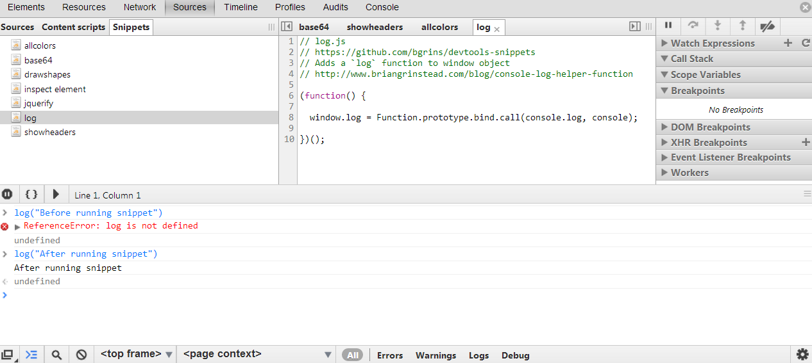

# Snippets That Extend the Console

## [console-save](console-save)

A simple way to save objects as `*.json` files from the console, includes a chrome extension along with a plain script.

## [log](log)

Adds a `log` function to window object.

## [log-globals](log-globals)

Logs your global variables to the console. Useful for finding leaked global variables.

