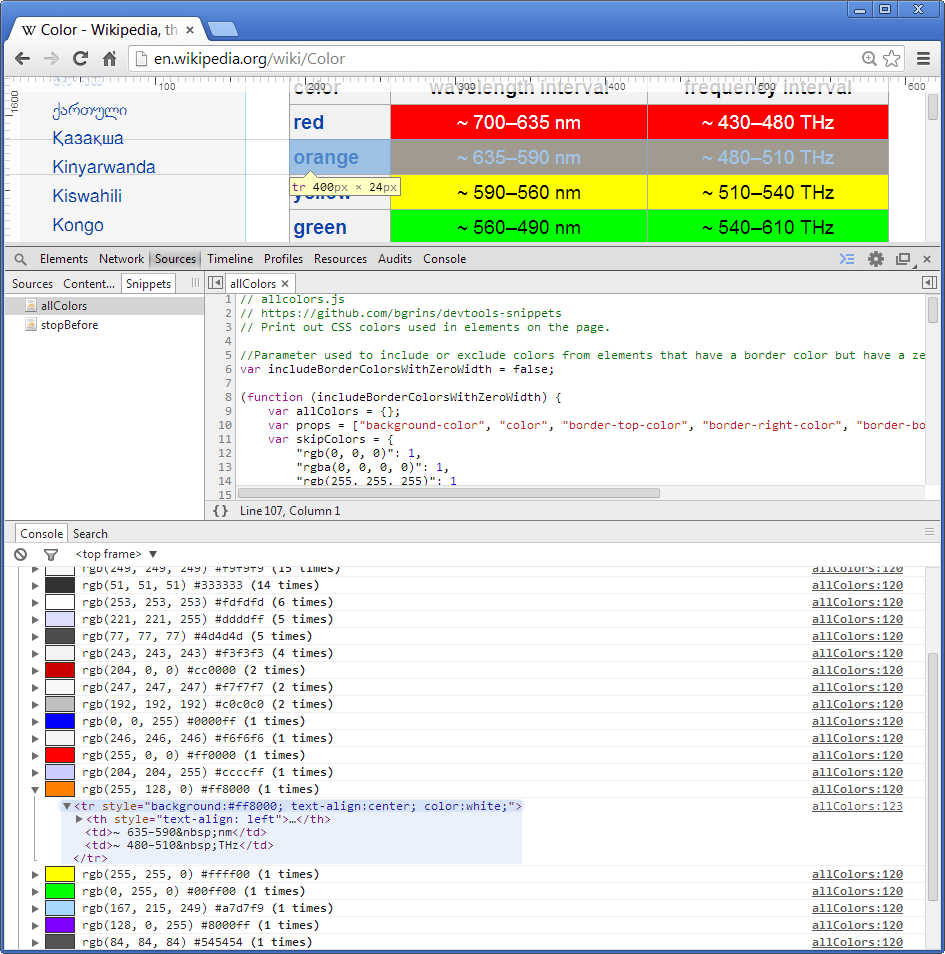
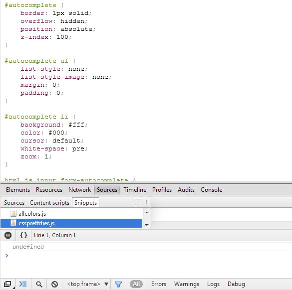
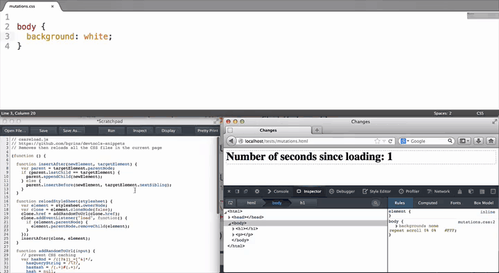
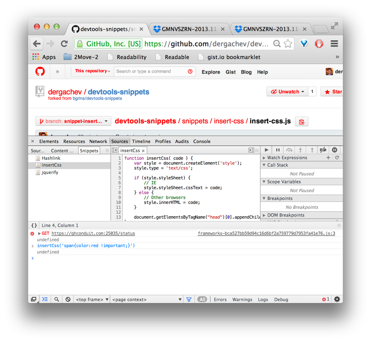

# Snippets Related to CSS / UX

## [allcolors](allcolors)

Print out all colors from computed styles used in elements on the page.  Uses styled console.log calls to visualize each color.

## [cssprettifier](cssprettifier)

Script for unminifying and prettifying a CSS file written

## [cssreload](cssreload)

Reloads all CSS files on the page.  It does so by adding a random GET parameter onto each stylesheet's `href` attribute.

## [insert-css](insert-css)

Defines `insertCss()` function which injects a snippet of CSS into the current page.

