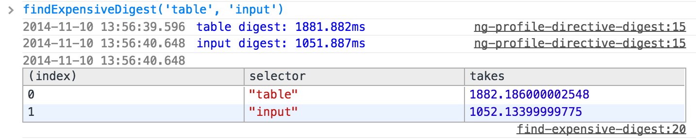
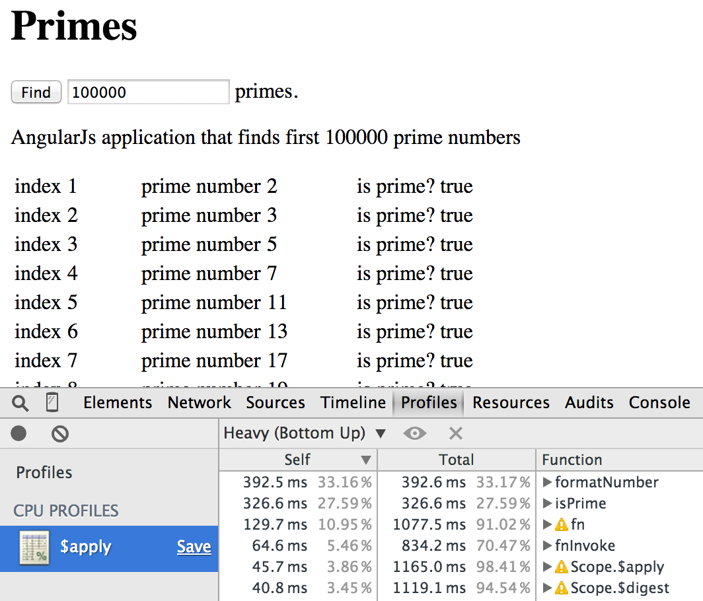
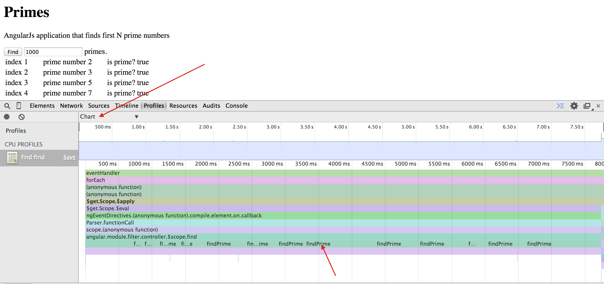

# Angular Performance

## [ng-count-digest-cycles](ng-count-digest-cycles)

Counts number of full digest cycles (from the root scope) that run when a scope method executes. Useful because sometimes you can get away with just a local digest cycle, rather than a full update. See [Local Angular scopes](http://glebbahmutov.com/blog/local-angular-scopes/).

## [ng-count-watchers](ng-count-watchers)
Counts total watchers in the page. More watchers - slower digest cycle.

## [ng-find-expensive-digest](ng-find-expensive-digest) 

Builds upon `ng-profile-local-digest.js` to measure digest duration for several selectors and print sorted table starting with the slowest digest duration.

## [ng-find-scope-property](ng-find-scope-property)

Finds all scopes that own a property with given name.

## [ng-idle-apply-timing](ng-idle-apply-timing)

Measures how long a digest cycle takes without any data changes. This measures purely how long all watched expressions take to compute and compare to previous values (dirty checking).

## [ng-monitor-digest-cycle](ng-monitor-digest-cycle)

Prints a string every time a digest cycle runs.

## [ng-profile-data-change](ng-profile-data-change)

Changes data on the scope, runs digest cycle to profile listeners.

## [ng-profile-local-digest](ng-profile-local-digest)

Runs idle digest cycle starting at the scope that surrounds given selector. Useful to find parts of the page with expensive watchers.

## [ng-profile-scope-method](ng-profile-scope-method)

Installs profile calls around a given scope method. When the method completes, the original non-instrumented version will be restored. The browser will have timeline and CPU profile.

## [ng-run-digest-cycle](ng-run-digest-cycle)

Triggers digest cycle starting with root scope.

## [ng-scope-size](ng-scope-size)

Finds total size of all user objects attached to all scopes. Smaller data - faster copying and comparison during digest cycle.

## [ng-throw-error](ng-throw-error) 

Throws an error from the digest cycle; useful for checking. If your [exception handler](http://glebbahmutov.com/blog/catch-all-errors-in-angular-app/) is working.