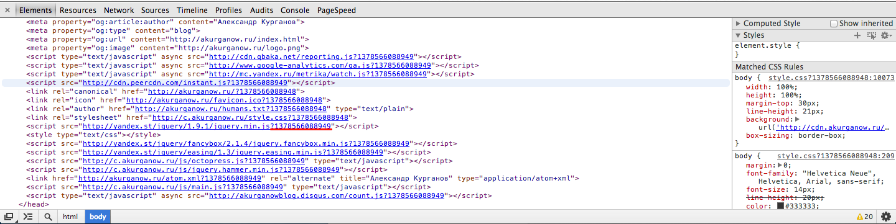
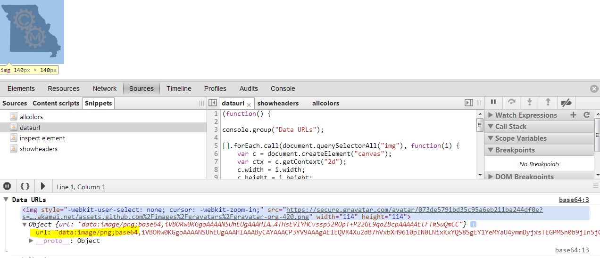
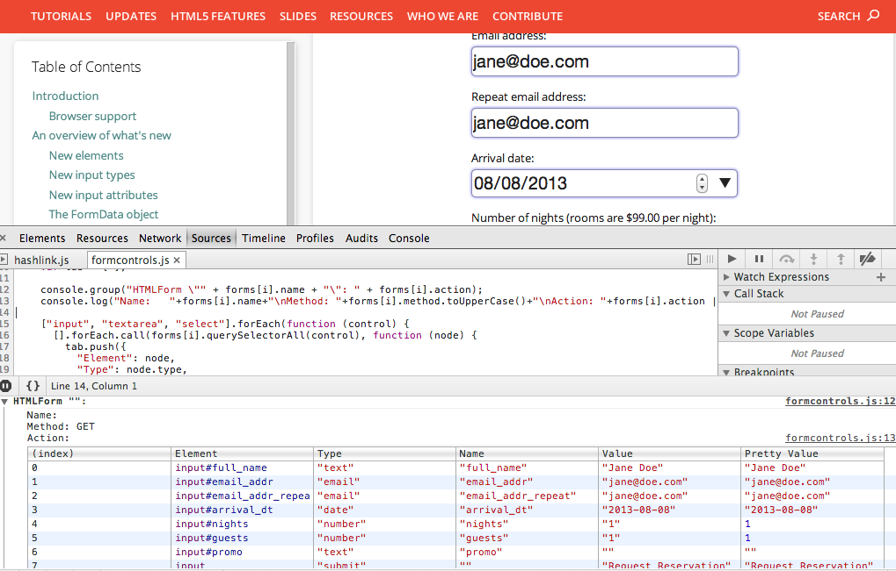
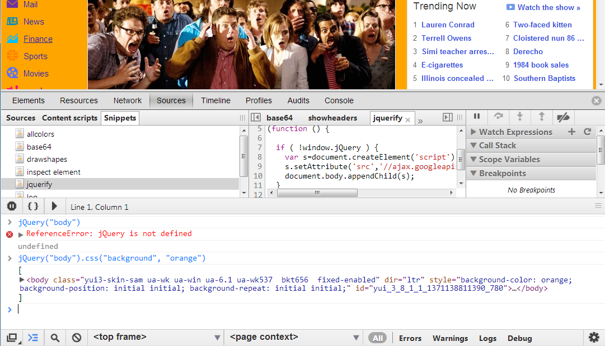

# Page Specific Snippets

## [cachebuster](cachebuster)

Overwrite all `link` and (optionally) `script` tags by adding Date.now() at the end of `href` and `src` attributes, respectively.

## [dataurl](dataurl)

Convert all images on the page to data URLs.

## [formcontrols](formcontrols)

Shows all html form elements with their values and types in a nice table.

## [jquerify](jquerify)

Includes jQuery onto a page if it is not yet included.

