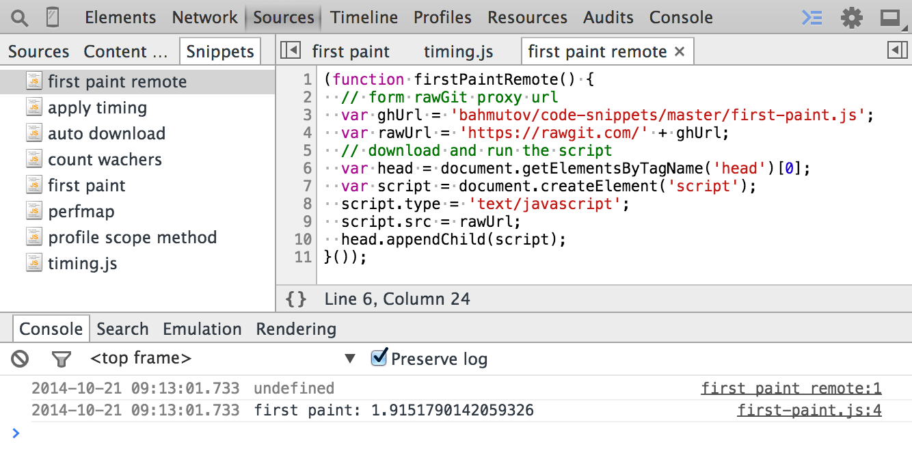
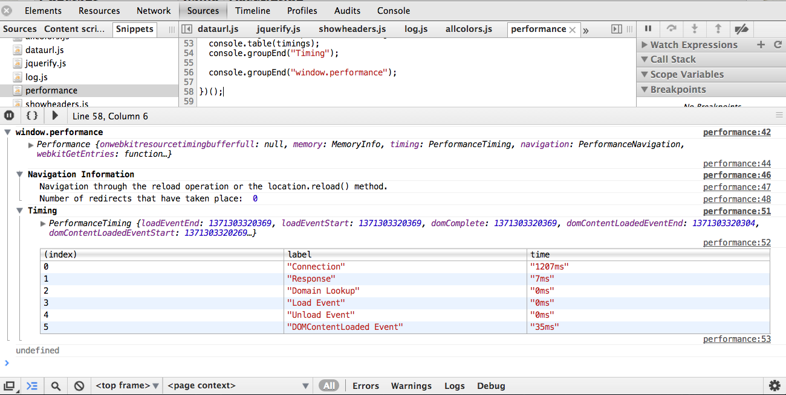
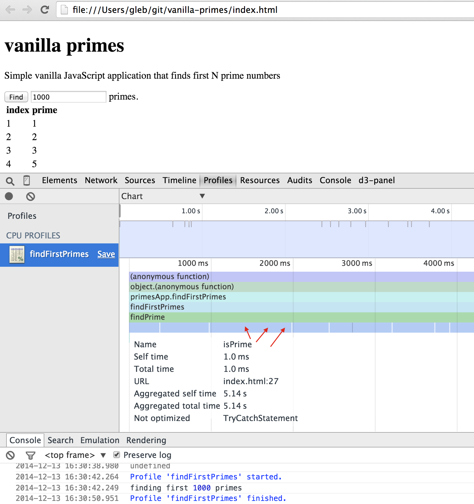
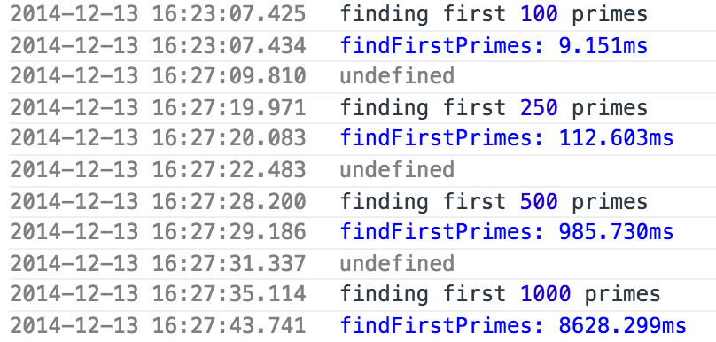
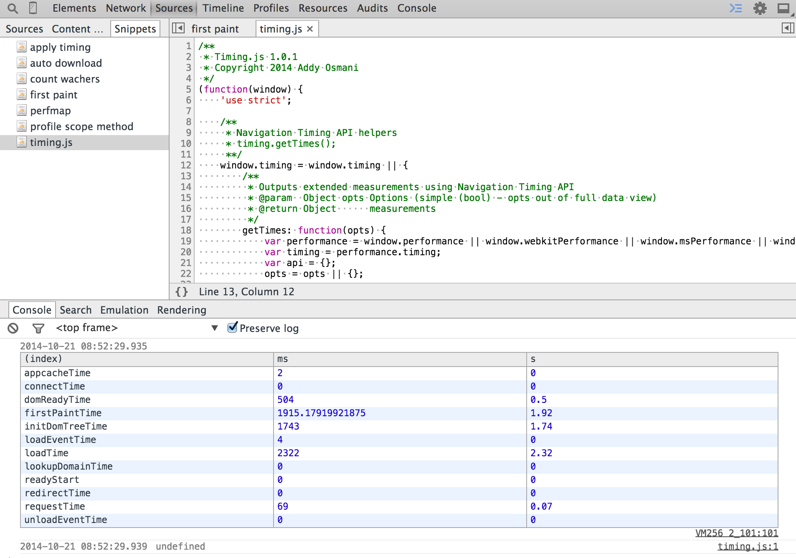

# DOM & CPU Generic Performance Related Snippets

## [first-paint](first-paint)

Time from the page reload to first visible contents

## [performance](performance)

Print out information about the `window.performance` object

## [profile-method-call](profile-method-call)

Profiles the time it takes for a specific method to run.

## [profile-prototype-method](profile-prototype-method)

Same as `profile-method-call` except works on prototype objects instead of instances

## [profile-separate-calls](profile-separate-calls)

Profiles actions where separate method calls start & stop the opertion.

## [time-method-call](time-method-call)

Measures a single method call time.

## [timing](timing)

Detailed page timing information.

