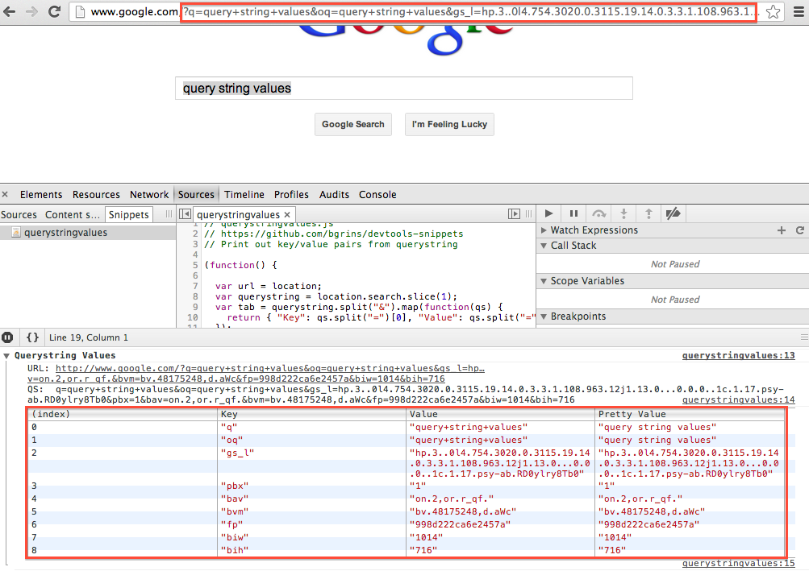
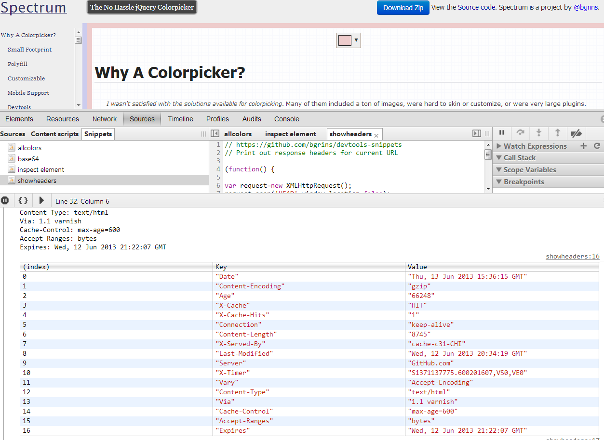
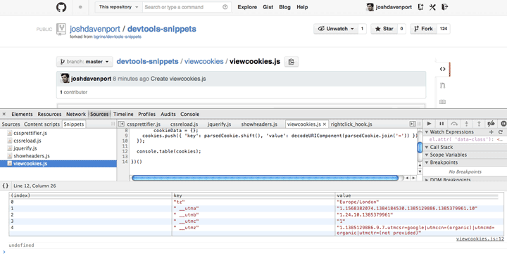

# Snippets for Dealing with the HTTP Request

## [querystringvalues](querystringvalues)

Print a table of query string (GET) values.

## [showheaders](showheaders)

Pretty prints the HTTP headers for the current page into the console.

## [viewcookies](viewcookies)

Shows all cookies stored in document.cookies in a console.table.

